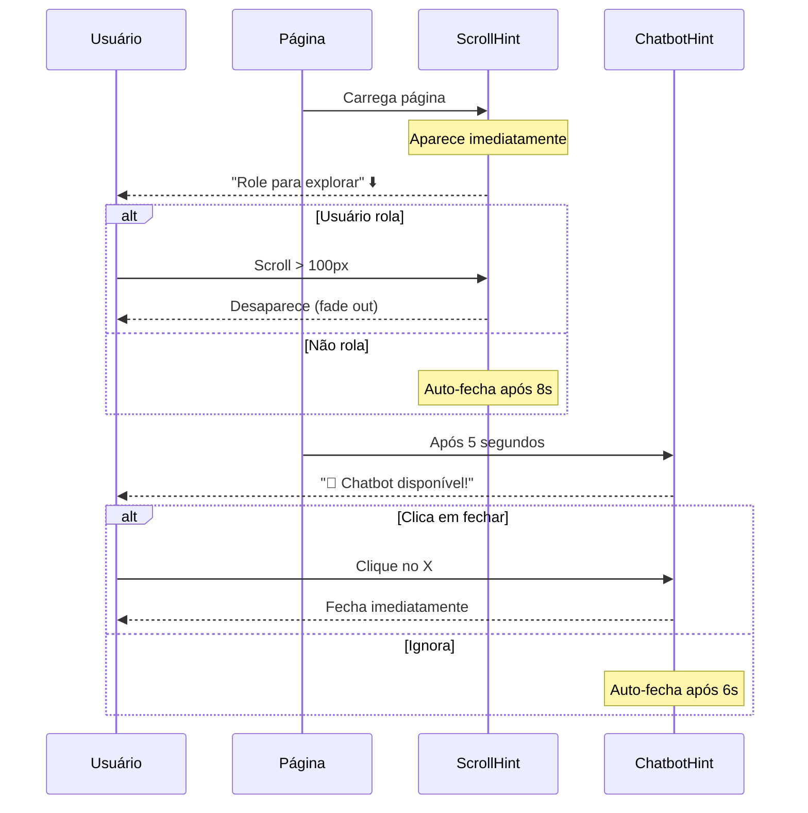

# 🔔 Sistema de Notificações de Navegação

## Visão Geral

Implementação de notificações em formato de pílula para guiar usuários durante a navegação, evitando que fiquem "presos" sem saber o que fazer.

## ✨ Componentes Criados

### 1. **ScrollHint.svelte** - Dica de Rolagem
📍 **Localização:** `src/lib/components/ui/ScrollHint.svelte`

**Funcionalidades:**
- Aparece automaticamente no topo esquerdo quando a página carrega
- Instrui o usuário a "Role para explorar"
- Animação de bounce para chamar atenção
- Desaparece automaticamente quando:
  - Usuário rola a página (>100px)
  - Após 8 segundos (se não rolar)

**Características:**
- 🎨 Gradiente roxo para azul
- 📍 Posição fixa no topo esquerdo
- ⬇️ Ícone de seta para baixo animado
- 🌊 Animação suave de entrada/saída

---

### 2. **ChatbotHint.svelte** - Dica do Chatbot
📍 **Localização:** `src/lib/components/ui/ChatbotHint.svelte`

**Funcionalidades:**
- Aparece após 5 segundos (delay configurável)
- Notifica o usuário que o chatbot está disponível
- Emoji 💬 + mensagem clara
- Botão de fechar manual
- Desaparece automaticamente após 6 segundos

**Características:**
- 🎨 Gradiente verde/esmeralda
- 📍 Posição fixa no topo esquerdo
- ⚡ Ícone de chat com pulse animado
- ❌ Botão de fechar opcional

---

### 3. **Toast.svelte** - Notificação Genérica (Base)
📍 **Localização:** `src/lib/components/ui/Toast.svelte`

**Funcionalidades:**
- Sistema reutilizável de notificações
- Configuração flexível de posição
- Suporte a ícones customizados via snippets
- Controle de duração e persistência

**Props:**
```typescript
{
  message: string;              // Mensagem a exibir
  icon?: Snippet;              // Ícone customizado (opcional)
  duration?: number;           // Tempo de exibição (padrão: 5000ms)
  position?: 'top-left'        // Posição na tela
           | 'top-right' 
           | 'bottom-left'
           | 'bottom-right';
  delay?: number;              // Atraso antes de aparecer
  persistent?: boolean;        // Não fecha automaticamente
  onClose?: () => void;        // Callback ao fechar
}
```

---

## 🎯 Fluxo de Interação



---

## 📊 Timeline de Aparição

```
0s ─────────> ScrollHint aparece
              ⬇️ "Role para explorar"
              
1-2s ───────> Usuário vê a dica
              
3s ─────────> ScrollHint continua visível
              
5s ─────────> ChatbotHint aparece
              💬 "Chatbot disponível"
              
8s ─────────> ScrollHint auto-fecha (se não rolou)
              
11s ────────> ChatbotHint auto-fecha
```

---

## 🎨 Design System

### Cores e Gradientes

**ScrollHint:**
- Gradiente: `purple-600 → blue-600`
- Sombra: `shadow-lg`
- Backdrop: `backdrop-blur-sm`

**ChatbotHint:**
- Gradiente: `green-600 → emerald-600`
- Sombra: `shadow-lg`
- Hover: `shadow-xl`

### Animações

**ScrollHint:**
```css
/* Bounce lento contínuo */
@keyframes bounce-slow {
  0%, 100% { transform: translateY(0); }
  50% { transform: translateY(-10px); }
}
animation: bounce-slow 2s ease-in-out infinite;
```

**Fade In/Out (Ambos):**
```css
@keyframes fade-in {
  from { opacity: 0; transform: translateY(-1rem); }
  to { opacity: 1; transform: translateY(0); }
}

@keyframes fade-out {
  from { opacity: 1; transform: translateY(0); }
  to { opacity: 0; transform: translateY(-1rem); }
}
```

---

## 🔧 Configuração no +page.svelte

```svelte
<script>
  import ScrollHint from '$lib/components/ui/ScrollHint.svelte';
  import ChatbotHint from '$lib/components/ui/ChatbotHint.svelte';
</script>

<!-- Notificações de navegação -->
<ScrollHint />
<ChatbotHint delay={5000} />

<!-- Resto do conteúdo -->
<Hero />
<ChatMockup />
<!-- ... -->
```

---

## ♿ Acessibilidade

### ARIA e Semântica

**ScrollHint:**
```html
<div role="status" aria-live="polite">
  <!-- Conteúdo -->
</div>
```

**ChatbotHint:**
```html
<div role="alert" aria-live="polite">
  <!-- Conteúdo -->
  <button aria-label="Fechar notificação">
    <!-- Ícone X -->
  </button>
</div>
```

### Boas Práticas
- ✅ `role="status"` para informações não urgentes
- ✅ `role="alert"` para notificações que requerem atenção
- ✅ `aria-live="polite"` para leitores de tela
- ✅ `aria-label` nos botões de fechar
- ✅ Contraste adequado (gradientes com texto branco)

---

## 📱 Responsividade

Todas as notificações são totalmente responsivas:

```css
/* Posicionamento fixo com espaçamento */
.fixed.left-4.top-4 {
  /* 
    left: 1rem (16px)
    top: 1rem (16px)
    Mantém distância das bordas em todas as telas
  */
}
```

**Mobile:** Notificações se adaptam automaticamente
**Desktop:** Posicionamento consistente
**Tablet:** Funciona perfeitamente entre os dois

---

## 🚀 Performance

### Otimizações Implementadas

1. **Timers Gerenciados:**
   ```typescript
   onMount(() => {
     const timer = setTimeout(/* ... */);
     return () => clearTimeout(timer); // Cleanup
   });
   ```

2. **Event Listeners Passivos:**
   ```typescript
   window.addEventListener('scroll', handler, { passive: true });
   ```

3. **CSS Animations (GPU-accelerated):**
   - Usa `transform` e `opacity` (não afeta layout)
   - `will-change` implícito via animations
   - Sem reflows durante animações

4. **Bundle Size:**
   - ScrollHint: ~0.6 KB (gzipped)
   - ChatbotHint: ~0.7 KB (gzipped)
   - Toast (base): ~1.2 KB (gzipped)
   - **Total:** ~2.5 KB adicional

---

## 🎯 Casos de Uso

### Quando Usar

✅ **ScrollHint:**
- Landing pages longas
- Primeiras visitas
- Conteúdo below-the-fold importante

✅ **ChatbotHint:**
- Quando há chatbot disponível
- Após usuário explorar um pouco
- Para incentivar engajamento

✅ **Toast (genérico):**
- Confirmações de ações
- Avisos temporários
- Status de processos

### Quando NÃO Usar

❌ Muitas notificações simultâneas
❌ Informações críticas (use modals)
❌ Formulários de entrada (use tooltips)
❌ Erro permanentes (use alerts in-line)

---

## 🔄 Evolução Futura

### Melhorias Possíveis

1. **Gestão de Estado Global:**
   ```typescript
   // Store para controlar múltiplas notificações
   import { writable } from 'svelte/store';
   
   export const toastQueue = writable<Toast[]>([]);
   ```

2. **Sistema de Fila:**
   - Mostrar notificações sequencialmente
   - Evitar sobreposição
   - Priorização de mensagens

3. **Persistência:**
   ```typescript
   // Lembrar que usuário já viu a dica
   localStorage.setItem('scroll-hint-seen', 'true');
   ```

4. **A/B Testing:**
   - Diferentes mensagens
   - Variações de timing
   - Cores e posições alternativas

5. **Analytics:**
   ```typescript
   function trackToastInteraction(action: 'view' | 'close' | 'timeout') {
     // Enviar para analytics
   }
   ```

---

## 📊 Métricas de Sucesso

### KPIs para Monitorar

- **Taxa de Scroll:** % usuários que rolam após ver hint
- **Tempo até Scroll:** Quanto tempo levam para rolar
- **Interação com Chatbot:** % que clicam após hint
- **Taxa de Fechamento:** % que fecham manualmente
- **Bounce Rate:** Mudança após implementação

### Como Medir

```typescript
// Exemplo de tracking
onMount(() => {
  const startTime = Date.now();
  
  const handleScroll = () => {
    const timeToScroll = Date.now() - startTime;
    analytics.track('scroll_hint_success', { timeToScroll });
  };
  
  window.addEventListener('scroll', handleScroll, { once: true });
});
```

---

## 🐛 Troubleshooting

### Problemas Comuns

**Q: Notificação não aparece**
```typescript
// Verifique se o delay está correto
<ChatbotHint delay={5000} /> // 5 segundos
```

**Q: Conflito de z-index**
```css
/* Aumente o z-index se necessário */
.fixed.z-50 { z-index: 9999; }
```

**Q: Animação não funciona**
```typescript
// Certifique-se que o estado está correto
let visible = $state(false); // Svelte 5
let visible = false; // Svelte 4
```

**Q: Memory leak em desenvolvimento**
```typescript
// Sempre limpe timers
return () => {
  clearTimeout(timer);
  window.removeEventListener('scroll', handler);
};
```

---

## 📝 Checklist de Implementação

- [x] Criar componente ScrollHint
- [x] Criar componente ChatbotHint
- [x] Criar componente Toast base
- [x] Integrar em +page.svelte
- [x] Testar animações
- [x] Verificar acessibilidade
- [x] Testar responsividade
- [x] Otimizar performance
- [x] Documentar uso
- [ ] Adicionar analytics (futuro)
- [ ] Implementar persistência (futuro)
- [ ] A/B testing (futuro)

---

## 🎨 Customização Rápida

### Mudar Cores

```svelte
<!-- ScrollHint -->
<div class="bg-gradient-to-r from-purple-600 to-blue-600">
  <!-- Trocar por: from-orange-600 to-red-600 -->
</div>

<!-- ChatbotHint -->
<div class="bg-gradient-to-r from-green-600 to-emerald-600">
  <!-- Trocar por: from-blue-600 to-cyan-600 -->
</div>
```

### Mudar Timing

```svelte
<ScrollHint />
<!-- Auto-fecha em 8s, pode ajustar no código -->

<ChatbotHint 
  delay={5000}    <!-- Atraso antes de aparecer -->
  duration={6000} <!-- Tempo visível -->
/>
```

### Mudar Posição

```svelte
<Toast 
  message="Teste"
  position="top-right"  <!-- ou bottom-left, etc -->
/>
```

---

## 💡 Exemplos de Uso Avançado

### Notificação com Ícone Customizado

```svelte
<Toast message="Ação concluída!">
  {#snippet icon()}
    <svg class="w-5 h-5" fill="currentColor" viewBox="0 0 20 20">
      <path d="M10 18a8 8 0 100-16 8 8 0 000 16zm3.707-9.293a1 1 0 00-1.414-1.414L9 10.586 7.707 9.293a1 1 0 00-1.414 1.414l2 2a1 1 0 001.414 0l4-4z"/>
    </svg>
  {/snippet}
</Toast>
```

### Notificação Persistente

```svelte
<Toast 
  message="Conexão perdida"
  persistent={true}
  position="bottom-right"
  onClose={() => console.log('Fechado')}
/>
```

---

## 🌟 Conclusão

Sistema completo de notificações implementado com foco em:
- 🎯 **UX:** Guiar usuário sem ser intrusivo
- ♿ **Acessibilidade:** ARIA e semântica correta
- 🚀 **Performance:** Otimizado e leve
- 🎨 **Design:** Consistente com a identidade visual
- 🔧 **Manutenibilidade:** Código limpo e documentado

**Impacto esperado:**
- Redução de bounce rate
- Aumento de engajamento
- Melhor descoberta de features
- UX mais fluida e guiada
